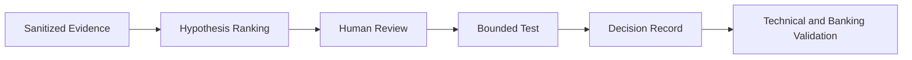

[🏠 Overview](README.md) · [🧠 Concepts](concepts.md) · [🧪 Lab](lab_guide.md) · [🚨 Troubleshooting](troubleshooting.md) · [🎯 Interview](interview_questions.md) · [📸 Evidence](screenshot_checklist.md)

---

# 🤖 AI-Assisted Performance Engineering

```text
Role: Senior Linux performance engineer and banking SRE
Context: Sanitized baseline, workload, saturation, latency, and SLO evidence
Task: Rank hypotheses and discriminating tests
Constraints: No secrets, destructive tuning, invented metrics, or employee profiling
Output: Facts, hypotheses, confidence, test, rollback, cost, and business validation
```



---

**🏦 FinBank AI DevSecOps · Day 016 of 120**
*Measure · Correlate · Diagnose · Validate · Optimize · Improve*
