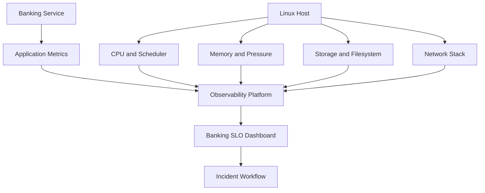
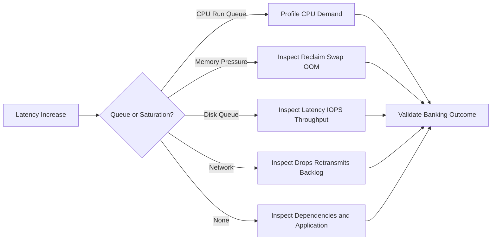

[🏠 Overview](README.md) · [🧠 Concepts](concepts.md) · [🧪 Lab](lab_guide.md) · [🚨 Troubleshooting](troubleshooting.md) · [🎯 Interview](interview_questions.md) · [📸 Evidence](screenshot_checklist.md)

---

# 🏗️ Performance Observability Architecture & Decision Engineering

## Telemetry Architecture

## Bottleneck Decision Tree

## Architecture Review Matrix

| Concern | Evidence | Decision question |
|---|---|---|
| SLO | p95/p99 latency and errors | Is customer impact real? |
| Capacity | utilization and saturation forecast | When is action required? |
| Resilience | failover and degraded-mode behavior | Does scaling preserve correctness? |
| Cost | provisioned versus consumed | Can cost reduce without SLO risk? |
| Change | baseline and rollback | How will improvement be proven? |

---

**🏦 FinBank AI DevSecOps · Day 016 of 120**
*Measure · Correlate · Diagnose · Validate · Optimize · Improve*
