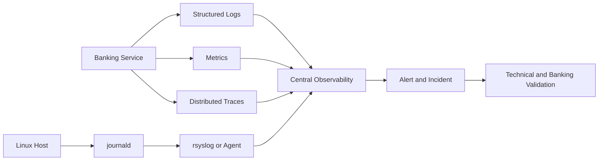

[🏠 Overview](README.md) · [🧠 Concepts](concepts.md) · [⌨️ Commands](commands.md) · [🧪 Lab](lab_guide.md) · [🚨 Troubleshooting](troubleshooting.md) · [🎯 Interview](interview_questions.md) · [📸 Evidence](screenshot_checklist.md)

---

# 🔭 Day 017: Enterprise Linux Observability, Logging & Banking Incident Response

### 🏦 FinBank AI DevSecOps · Observability Engineering Phase · Day 17 of 120

> [!IMPORTANT]
> Day017 treats logs as evidence, not decoration. Every investigation must use bounded queries, UTC timestamps, correlation identifiers, data minimization, repeatable commands, and banking-business validation.

## Premium Navigation
| Learn | Engineer | Govern | Validate |
|---|---|---|---|
| [Deep Concepts](concepts.md) | [Hands-on Lab](lab_guide.md) | [Security](security_notes.md) | [Testing](testing_strategy.md) |
| [Explained Commands](commands.md) | [Architecture](architecture.md) | [Banking](banking_relevance.md) | [Evidence](screenshot_checklist.md) |
| [AI Workflow](ai_assisted_workflow.md) | [RCA Playbook](troubleshooting.md) | [Git Workflow](git_workflow.md) | [Executive Summary](summary.md) |

## Advanced Outcomes
- Explain logs, metrics, traces, events, and profiles as complementary observability signals.
- Query journald safely by boot, unit, priority, cursor, and time window.
- Review rsyslog, persistent journal storage, retention, rotation, and forwarding architecture.
- Create structured synthetic banking events with correlation and transaction identifiers.
- Build an incident timeline without publishing raw identities, IP addresses, or secrets.
- Connect technical recovery to payment, ledger, queue, fraud, and audit validation.

## Completion Dashboard
| Capability | Evidence | Status |
|---|---|:---:|
| Repository safety | root, branch, origin | ⬜ |
| Journal baseline | boots, disk use, errors | ⬜ |
| Logging pipeline | journald and rsyslog review | ⬜ |
| Rotation/retention | policy inventory | ⬜ |
| Synthetic events | structured correlation flow | ⬜ |
| Incident timeline | sanitized evidence | ⬜ |
| Controlled failure | exit-code validation | ⬜ |
| Git governance | validator and PR | ⬜ |

## Observability Flow

> [!WARNING]
> Service recovery is not incident closure. Verify transaction state, idempotency, queues, ledger posting, reconciliation, audit continuity, and customer impact.

## Premium Deliverables
17 fully authored documents, 5 scripts, 4 templates, 10 screenshots, 20 advanced interview questions, 8 structured RCA scenarios, completed lab notes, rich command explanations, 700+ word executive summary, diagrams, and strict rendering validation.

---

**🏦 FinBank AI DevSecOps · Day 017 of 120**
*Observe · Correlate · Investigate · Recover · Validate · Improve*
