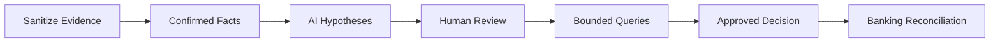

[🏠 Overview](README.md) · [🧠 Concepts](concepts.md) · [⌨️ Commands](commands.md) · [🧪 Lab](lab_guide.md) · [🚨 Troubleshooting](troubleshooting.md) · [🎯 Interview](interview_questions.md) · [📸 Evidence](screenshot_checklist.md)

---

# 🤖 AI-Assisted Incident Correlation

```text
Role: Senior Linux observability architect and banking SRE
Context: Sanitized structured events, SLOs, deployment markers, and timeline
Task: Separate facts from hypotheses and rank discriminating queries
Constraints: No secrets, real identities, destructive actions, invented evidence, or employee profiling
Output: Facts, hypotheses, confidence, query, containment risk, rollback, and banking validation
```



---

**🏦 FinBank AI DevSecOps · Day 017 of 120**
*Observe · Correlate · Investigate · Recover · Validate · Improve*
