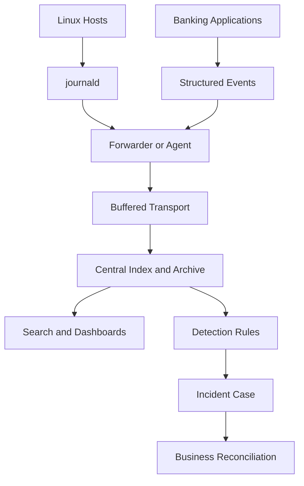
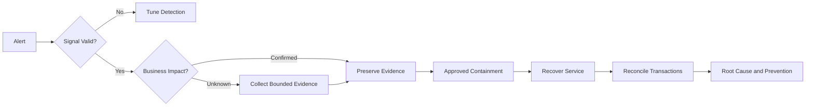

[🏠 Overview](README.md) · [🧠 Concepts](concepts.md) · [⌨️ Commands](commands.md) · [🧪 Lab](lab_guide.md) · [🚨 Troubleshooting](troubleshooting.md) · [🎯 Interview](interview_questions.md) · [📸 Evidence](screenshot_checklist.md)

---

# 🏗️ Observability Architecture & Incident Decisions

## Central Logging Architecture

## Incident Decision Tree

## Decision Matrix
| Decision | Evidence | Trade-off |
|---|---|---|
| local vs central retention | volume, outage mode, compliance | cost vs resilience |
| sync vs async forwarding | loss tolerance and latency | durability vs performance |
| full vs sampled traces | traffic/cost/criticality | visibility vs overhead |
| redaction point | schema and trust boundary | privacy vs diagnostic value |

---

**🏦 FinBank AI DevSecOps · Day 017 of 120**
*Observe · Correlate · Investigate · Recover · Validate · Improve*
