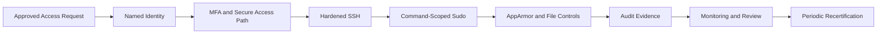

[🏠 Overview](README.md) · [🧠 Concepts](concepts.md) · [⌨️ Commands](commands.md) · [🧪 Lab](lab_guide.md) · [🚨 Troubleshooting](troubleshooting.md) · [🎯 Interview](interview_questions.md) · [📸 Evidence](screenshot_checklist.md)

---

# 🛡️ Day 018: Enterprise Linux Security Hardening, Identity Controls & Banking Compliance

### 🏦 FinBank AI DevSecOps · Security Engineering Phase · Day 18 of 120

> [!IMPORTANT]
> Day018 is a read-only, evidence-first security-hardening module. The objective is to understand effective identity, privilege, SSH, PAM, permission, ACL, kernel, and auditing controls without modifying a shared EC2 host.

## Premium Navigation

| Learn | Engineer | Govern | Validate |
|---|---|---|---|
| [Deep Concepts](concepts.md) | [Hands-on Lab](lab_guide.md) | [Security Controls](security_notes.md) | [Testing](testing_strategy.md) |
| [Explained Commands](commands.md) | [Architecture](architecture.md) | [Banking Compliance](banking_relevance.md) | [Evidence](screenshot_checklist.md) |
| [AI Workflow](ai_assisted_workflow.md) | [RCA Playbook](troubleshooting.md) | [Git Workflow](git_workflow.md) | [Executive Summary](summary.md) |

## Advanced Learning Outcomes

- Explain Linux identity resolution, UID/GID ownership, service accounts, shells, and group-based authorization.
- Review effective sudo privilege and distinguish command delegation from unrestricted administrative access.
- Explain PAM authentication, account, password, and session control without editing the PAM stack.
- Review effective SSH security settings and understand recovery requirements before any real hardening change.
- Inspect file modes, ACLs, SUID/SGID exposure, and world-writable paths in a bounded scope.
- Validate selected kernel protections, AppArmor state, and audit capability.
- Translate technical findings into banking segregation-of-duties, privileged-access, audit, and recovery controls.

## Executive Completion Dashboard

| Control Domain | Required Evidence | Status |
|---|---|:---:|
| Repository Safety | root, branch, origin | ⬜ |
| Identity Governance | users, groups, service accounts | ⬜ |
| Privileged Access | effective sudo review | ⬜ |
| Remote Access | effective SSH settings | ⬜ |
| File Security | modes, ACLs, SUID/SGID | ⬜ |
| Host Controls | AppArmor and sysctl | ⬜ |
| Compliance Evidence | control matrix and decision record | ⬜ |
| Git Governance | validator and PR | ⬜ |

## Defense-in-Depth Architecture

> [!WARNING]
> A technically valid login does not prove authorization. Access must also be approved, attributable, least-privileged, monitored, time-bounded where appropriate, and periodically reviewed.

## Premium Deliverables

- 17 fully authored premium documents
- 5 read-only security review scripts
- 4 enterprise templates
- 10 screenshot milestones
- 20 senior and architect-level interview questions
- 8 structured production security RCA scenarios
- Fully completed engineering lab notes
- Explained commands with examples, interpretation, production use, banking relevance, and interview guidance
- 800+ word executive summary

---

**🏦 FinBank AI DevSecOps · Day 018 of 120**
*Harden · Verify · Govern · Detect · Recover · Improve*
