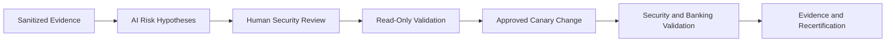

[🏠 Overview](README.md) · [🧠 Concepts](concepts.md) · [⌨️ Commands](commands.md) · [🧪 Lab](lab_guide.md) · [🚨 Troubleshooting](troubleshooting.md) · [🎯 Interview](interview_questions.md) · [📸 Evidence](screenshot_checklist.md)

---

# 🤖 AI-Assisted Security Review With Human Governance

```text
Role: Senior Linux security architect and banking SRE
Context: Sanitized identity, privilege, SSH, file, MAC, kernel, and audit evidence
Task: Prioritize controls, risks, and discriminating read-only tests
Constraints: No secrets, real identity profiling, destructive commands, invented evidence, or automated approval
Output: Finding, evidence, effective risk, safe test, remediation, rollback, banking validation
```



AI supports analysis but cannot certify compliance, approve privilege, infer employee intent, or replace tested recovery evidence.

---

**🏦 FinBank AI DevSecOps · Day 018 of 120**
*Harden · Verify · Govern · Detect · Recover · Improve*
