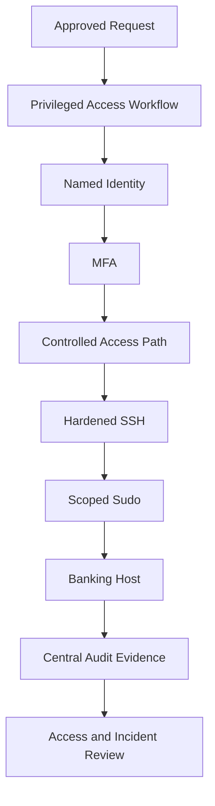
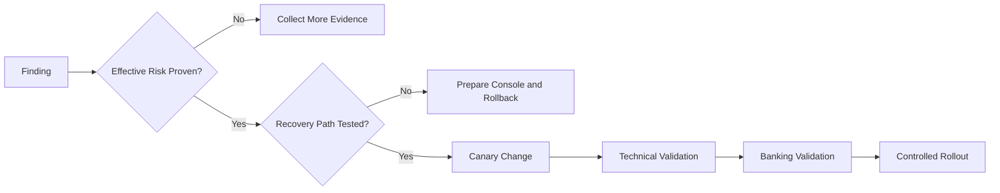

[🏠 Overview](README.md) · [🧠 Concepts](concepts.md) · [⌨️ Commands](commands.md) · [🧪 Lab](lab_guide.md) · [🚨 Troubleshooting](troubleshooting.md) · [🎯 Interview](interview_questions.md) · [📸 Evidence](screenshot_checklist.md)

---

# 🏗️ Security Architecture, Trust Boundaries & Decisions

## Privileged Access Architecture

## Hardening Change Decision Tree

## Decision Matrix

| Decision | Selected Approach | Rejected Shortcut | Reason |
|---|---|---|---|
| admin access | named, approved, scoped sudo | shared root account | attribution and lifecycle |
| SSH auth | managed keys/MFA path | broad password auth | credential-attack reduction |
| file access | owner/group/ACL by need | world-writable files | least privilege |
| MAC | enforced tested profiles | global disable | blast-radius reduction |
| compliance | measured evidence | checklist assertion only | defensible assurance |

> [!CAUTION]
> Security hardening without a recovery path can create an availability incident. Every access-control change requires validation and rollback.

---

**🏦 FinBank AI DevSecOps · Day 018 of 120**
*Harden · Verify · Govern · Detect · Recover · Improve*
