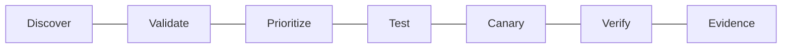

[Overview](README.md) | [Concepts](concepts.md) | [Commands](commands.md) | [Lab](lab_guide.md) | [Troubleshooting](troubleshooting.md) | [Interview](interview_questions.md) | [Evidence](screenshot_checklist.md)
---
# 🩹 Day 019: Enterprise Linux Patch, Vulnerability & Banking Change Governance
**IMPORTANT:** Read-only package metadata and simulated upgrade only. No installation, removal, repository edit, restart, reboot, or AWS mutation.
## Outcomes
- Explain provenance, versions, dependencies, backports, exploitability, CVSS limitations, and effective risk.
- Design testing, canary rings, recovery, exceptions, evidence, and banking validation.
## Dashboard
| Domain | Evidence | Status |
|---|---|---|
| Package baseline | OS, kernel, packages, candidates | Pending |
| Risk triage | exposure, exploitability, criticality | Pending |
| Change readiness | simulation, canary, recovery | Pending |

## Purpose
This document explains the control, why engineers use it, how to interpret evidence, where it applies in production, and how it protects banking availability, integrity, auditability, and recovery.
## Practical Use
Use read-only metadata, approved repositories, representative testing, canary rings, monitoring, abort thresholds, and tested recovery. Never infer vulnerability solely from an available package update.
## Production Example
A payment gateway candidate update is validated for provenance, exploitability, compatibility, SLO impact, timeout handling, ledger reconciliation, and audit continuity before progressive rollout.
## Banking Relevance
The workflow preserves payment processing, authentication, fraud controls, databases, queues, ledgers, settlement windows, and regulatory evidence.
---
**FinBank AI DevSecOps | Day 019 of 120**
