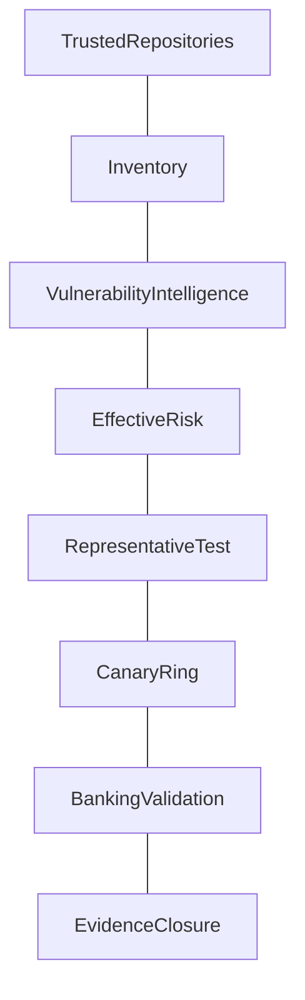

[Overview](README.md) | [Concepts](concepts.md) | [Commands](commands.md) | [Lab](lab_guide.md) | [Troubleshooting](troubleshooting.md) | [Interview](interview_questions.md) | [Evidence](screenshot_checklist.md)
---
# 🏗️ Patch Architecture, Rings & Recovery Decisions

## Decisions
| Decision | Evidence | Trade-off |
|---|---|---|
| immediate or scheduled | exploit and business tier | urgency vs change risk |
| in-place or rebuild | state and recovery | speed vs consistency |
| rollback or forward fix | schema and data | recovery vs complexity |
## Purpose
This document explains the control, why engineers use it, how to interpret evidence, where it applies in production, and how it protects banking availability, integrity, auditability, and recovery.
## Practical Use
Use read-only metadata, approved repositories, representative testing, canary rings, monitoring, abort thresholds, and tested recovery. Never infer vulnerability solely from an available package update.
## Production Example
A payment gateway candidate update is validated for provenance, exploitability, compatibility, SLO impact, timeout handling, ledger reconciliation, and audit continuity before progressive rollout.
## Banking Relevance
The workflow preserves payment processing, authentication, fraud controls, databases, queues, ledgers, settlement windows, and regulatory evidence.
---
**FinBank AI DevSecOps | Day 019 of 120**
