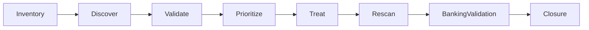

[🏠 Overview](README.md) · [🧠 Concepts](concepts.md) · [⌨️ Commands](commands.md) · [🧪 Lab](lab_guide.md) · [🚨 Troubleshooting](troubleshooting.md) · [🎯 Interview](interview_questions.md) · [📸 Evidence](screenshot_checklist.md)

---

# 🛡️ Day 020: Enterprise Vulnerability Scanning, Compliance Baselines & Banking Risk Governance

> [!NOTE]
> Day020 uses read-only aggregate metadata and synthetic findings. It does not install a scanner, run intrusive probes, publish real vulnerabilities, modify controls, or claim compliance certification.

## Why This Matters

Vulnerability discovery is only the start. Enterprise governance validates applicability, combines technical and banking context, assigns ownership, authorizes treatment, proves service safety, rescans, and retains closure evidence.

## Production and Banking Lens

Every decision protects payment availability, authentication, fraud controls, queues, databases, ledgers, reconciliation, audit continuity, and recovery objectives.

## Premium Navigation

| Learn | Engineer | Govern | Validate |
|---|---|---|---|
| [Concepts](concepts.md) | [Lab](lab_guide.md) | [Security](security_notes.md) | [Testing](testing_strategy.md) |
| [Commands](commands.md) | [Architecture](architecture.md) | [Banking](banking_relevance.md) | [Evidence](screenshot_checklist.md) |

## Learning Outcomes

- Distinguish scanning, vulnerability management, compliance evidence, and certification.
- Explain authenticated and external assessment perspectives.
- Use exploitability, exposure, criticality, controls, and recovery readiness for priority.
- Govern false positives, exceptions, SLAs, rescans, and evidence retention.
- Validate remediation with banking service and transaction checks.

> [!WARNING]
> A scanner result is an investigation input, not proof of exploitability, compliance, business impact, or successful remediation.

---

**🏦 FinBank AI DevSecOps · Day 020 of 120**
*Discover · Validate · Prioritize · Remediate · Prove · Govern*
