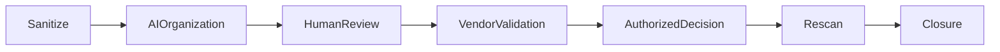

[🏠 Overview](README.md) · [🧠 Concepts](concepts.md) · [⌨️ Commands](commands.md) · [🧪 Lab](lab_guide.md) · [🚨 Troubleshooting](troubleshooting.md) · [🎯 Interview](interview_questions.md) · [📸 Evidence](screenshot_checklist.md)

---

# 🤖 AI-Assisted Triage With Human Governance

```text
Role: Senior vulnerability manager, Linux architect, banking SRE, and compliance engineer
Context: Sanitized inventory, vendor evidence, exposure, exploit intelligence, business tier, controls, and recovery readiness
Task: Organize evidence, identify gaps, rank hypotheses, and propose treatment options
Constraints: No secrets, real finding disclosure, automatic acceptance, invented evidence, or certification
Output: Applicability, confidence, effective risk, missing evidence, treatment, rollback, banking validation, owner, and closure criteria
```



> [!WARNING]
> AI cannot approve residual risk, grant exceptions, certify compliance, or replace authoritative technical and business validation.

---

**🏦 FinBank AI DevSecOps · Day 020 of 120**
*Discover · Validate · Prioritize · Remediate · Prove · Govern*
