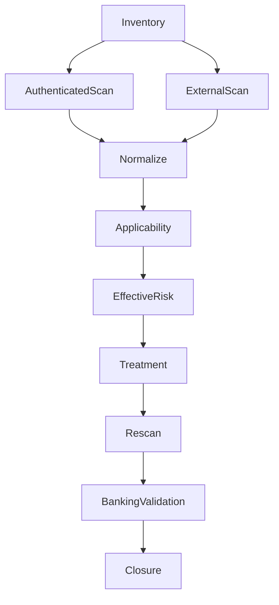
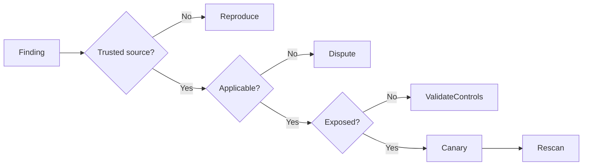

[🏠 Overview](README.md) · [🧠 Concepts](concepts.md) · [⌨️ Commands](commands.md) · [🧪 Lab](lab_guide.md) · [🚨 Troubleshooting](troubleshooting.md) · [🎯 Interview](interview_questions.md) · [📸 Evidence](screenshot_checklist.md)

---

# 🏗️ Assessment Architecture, Trust Boundaries & Decisions

> [!NOTE]
> Day020 uses read-only aggregate metadata and synthetic findings. It does not install a scanner, run intrusive probes, publish real vulnerabilities, modify controls, or claim compliance certification.

## Why This Matters

Vulnerability discovery is only the start. Enterprise governance validates applicability, combines technical and banking context, assigns ownership, authorizes treatment, proves service safety, rescans, and retains closure evidence.

## Production and Banking Lens

Every decision protects payment availability, authentication, fraud controls, queues, databases, ledgers, reconciliation, audit continuity, and recovery objectives.

| Decision | Evidence | Trade-off |
|---|---|---|
| authenticated vs external | scope and trust boundary | depth vs attacker view |
| remediate now vs schedule | exploit and business tier | urgency vs change risk |
| patch vs mitigate | fix quality and controls | risk removal vs speed |
| accept vs dispute | residual risk and applicability | governance vs unnecessary work |

> [!CAUTION]
> Scanner credentials are privileged assets requiring least privilege, secure storage, rotation, monitoring, and revocation.

---

**🏦 FinBank AI DevSecOps · Day 020 of 120**
*Discover · Validate · Prioritize · Remediate · Prove · Govern*
