[🏠 Overview](README.md) · [🧠 Concepts](concepts.md) · [⌨️ Commands](commands.md) · [🧪 Lab](lab_guide.md) · [🚨 Troubleshooting](troubleshooting.md) · [🎯 Interview](interview_questions.md) · [📸 Evidence](screenshot_checklist.md)

---

# ⚙️ Day 021: Enterprise Configuration Management, Drift Detection & Banking Change Assurance

> [!NOTE]
> Day021 is a repository-local configuration-governance lab. It uses synthetic desired-state files, checksums, diffs, approval records, and simulated remediation. It does not modify system configuration, restart services, install agents, or create AWS resources.

## Why This Matters

Configuration drift can bypass reviewed standards even when software versions are current. Mature operations define desired state, measure actual state, classify deviations, authorize remediation, verify service behavior, and retain evidence.

## Banking Lens

Configuration governance protects payment availability, authentication integrity, segregation of duties, auditability, transaction correctness, and recoverability.

## Premium Navigation

| Learn | Engineer | Govern | Validate |
|---|---|---|---|
| [Concepts](concepts.md) | [Lab](lab_guide.md) | [Security](security_notes.md) | [Testing](testing_strategy.md) |
| [Commands](commands.md) | [Architecture](architecture.md) | [Banking](banking_relevance.md) | [Evidence](screenshot_checklist.md) |

## Advanced Learning Outcomes

- Explain desired state, actual state, drift, convergence, idempotency, and immutable patterns.
- Distinguish approved change, emergency change, unauthorized drift, and environment-specific variance.
- Build checksummed desired-state evidence without touching production configuration.
- Classify drift by security, reliability, compliance, and banking impact.
- Design canary remediation, rollback, validation, exception, and evidence controls.
- Identify where AI can assist drift analysis without authorizing changes.

## Completion Dashboard

| Capability | Evidence | Status |
|---|---|:---:|
| Repository safety | root, origin and branch | ⬜ |
| Desired state | synthetic baseline and checksum | ⬜ |
| Drift detection | diff and classification | ⬜ |
| Remediation decision | owner, canary, rollback | ⬜ |
| Banking assurance | service and transaction checks | ⬜ |
| Controlled failure | missing-input exit code | ⬜ |
| Final governance | validator, screenshots and Git | ⬜ |

```mermaid
flowchart LR
  POLICY[Policy and Approved Standard] --> DESIRED[Versioned Desired State]
  DESIRED --> MEASURE[Measure Actual State]
  MEASURE --> DIFF[Detect Drift]
  DIFF --> CLASSIFY[Classify Risk and Ownership]
  CLASSIFY --> DECIDE[Approve Remediation or Exception]
  DECIDE --> CANARY[Canary Convergence]
  CANARY --> VERIFY[Technical and Banking Validation]
  VERIFY --> EVIDENCE[Evidence Closure]
```

> [!WARNING]
> Automatic convergence without ownership, canary scope, rollback, and service validation can convert configuration drift into a production outage.

## Premium Deliverables

- 17 Day017-replica documents
- 5 safe executable scripts
- 4 governance templates
- 10 screenshot milestones
- 20 senior interview questions
- 8 production RCA scenarios
- Completed engineering lab notes
- 800+ word executive summary

---

**🏦 FinBank AI DevSecOps · Day 021 of 120**
*Define · Detect · Review · Remediate · Verify · Govern*
