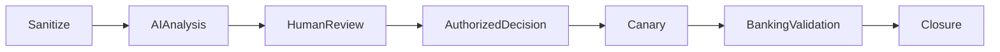

[🏠 Overview](README.md) · [🧠 Concepts](concepts.md) · [⌨️ Commands](commands.md) · [🧪 Lab](lab_guide.md) · [🚨 Troubleshooting](troubleshooting.md) · [🎯 Interview](interview_questions.md) · [📸 Evidence](screenshot_checklist.md)

---

# 🤖 AI-Assisted Drift Analysis With Human Approval

```text
Role: Senior platform architect, SRE, security engineer, and banking operations reviewer
Context: Sanitized desired state, actual state, diff, change record, SLOs, ownership, and recovery evidence
Task: Classify drift, identify missing evidence, compare remediation options, and propose discriminating tests
Constraints: No secrets, real configuration disclosure, automatic approval, destructive action, or invented evidence
Output: Drift class, confidence, owner, business impact, remediation options, rollback, validation, exception, and closure criteria
```



> [!WARNING]
> AI cannot approve changes, infer employee intent, accept risk, expose secrets, or replace technical and business validation.

---

**🏦 FinBank AI DevSecOps · Day 021 of 120**
*Define · Detect · Review · Remediate · Verify · Govern*
