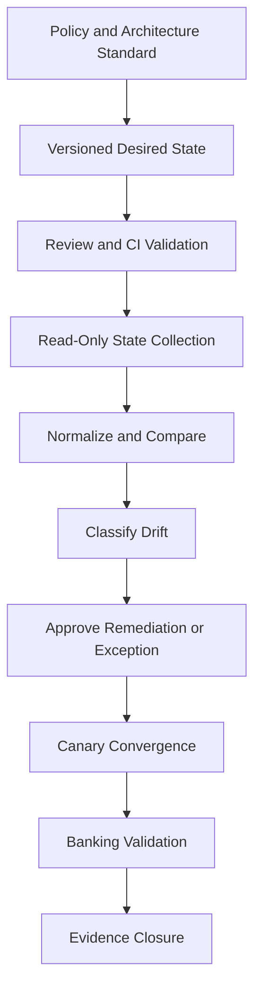
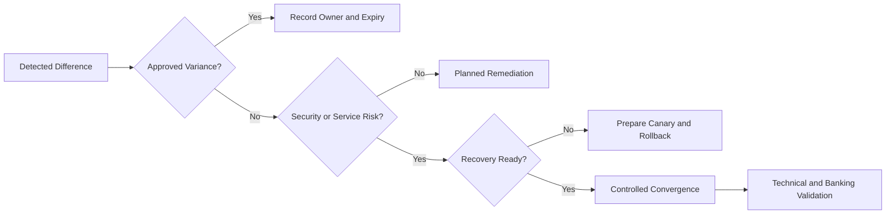

[🏠 Overview](README.md) · [🧠 Concepts](concepts.md) · [⌨️ Commands](commands.md) · [🧪 Lab](lab_guide.md) · [🚨 Troubleshooting](troubleshooting.md) · [🎯 Interview](interview_questions.md) · [📸 Evidence](screenshot_checklist.md)

---

# 🏗️ Desired-State Architecture, Trust Boundaries & Decisions

> [!NOTE]
> Day021 is a repository-local configuration-governance lab. It uses synthetic desired-state files, checksums, diffs, approval records, and simulated remediation. It does not modify system configuration, restart services, install agents, or create AWS resources.

## Why This Matters

Configuration drift can bypass reviewed standards even when software versions are current. Mature operations define desired state, measure actual state, classify deviations, authorize remediation, verify service behavior, and retain evidence.

## Banking Lens

Configuration governance protects payment availability, authentication integrity, segregation of duties, auditability, transaction correctness, and recoverability.

| Decision | Evidence | Trade-off |
|---|---|---|
| mutable vs immutable | workload state and rebuild maturity | speed vs consistency |
| observe vs auto-remediate | confidence and blast radius | detection vs outage risk |
| reload vs restart | application capability and availability | freshness vs disruption |
| global vs environment override | control objective and local need | standardization vs flexibility |
| exception vs remediation | residual risk and expiry | continuity vs debt |

> [!CAUTION]
> Desired-state systems can become a high-blast-radius control plane. Protect repository changes, runner identity, secrets, approvals, and rollback.

---

**🏦 FinBank AI DevSecOps · Day 021 of 120**
*Define · Detect · Review · Remediate · Verify · Govern*
