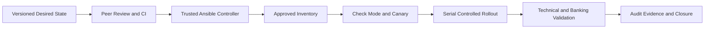

[🏠 Overview](README.md) · [🧠 Concepts](concepts.md) · [⌨️ Commands](commands.md) · [🧪 Lab](lab_guide.md) · [🚨 Troubleshooting](troubleshooting.md) · [🎯 Interview](interview_questions.md) · [📸 Evidence](screenshot_checklist.md)

---

# 🤖 Day 022: Ansible Foundations, Idempotent Automation & Banking Change Governance

> [!NOTE]
> Day022 is a safe Ansible-foundations and automation-governance lab. The package uses a localhost inventory, check mode, syntax validation, synthetic banking configuration, and repository-local evidence. It does not connect to remote hosts, retrieve secrets, restart services, or create AWS resources.

## Why This Matters

Configuration automation converts desired state into repeatable execution. Enterprise safety requires deterministic inventory, idempotent tasks, check mode, review, bounded privilege, canary rollout, recovery, business validation, and attributable evidence.

## Banking Lens

Automation must preserve payment availability, authentication, idempotency, queues, databases, ledgers, fraud controls, audit delivery, and recovery objectives.

## Premium Navigation

| Learn | Engineer | Govern | Validate |
|---|---|---|---|
| [Concepts](concepts.md) | [Lab](lab_guide.md) | [Security](security_notes.md) | [Testing](testing_strategy.md) |
| [Commands](commands.md) | [Architecture](architecture.md) | [Banking](banking_relevance.md) | [Evidence](screenshot_checklist.md) |

## Advanced Learning Outcomes

- Explain controller, inventory, host patterns, modules, tasks, plays, variables, handlers, facts, roles, and collections.
- Design idempotent automation and distinguish convergence from command execution.
- Use syntax checks, check mode, diff mode, tags, limits, serial batches, and failure controls safely.
- Govern secrets, privilege escalation, inventory ownership, artifact integrity, and evidence.
- Build a localhost-only playbook that renders synthetic configuration into `/tmp`.
- Design canary, rollback, banking validation, exception, and closure controls.

## Completion Dashboard

| Capability | Evidence | Status |
|---|---|:---:|
| Repository safety | root, branch, origin | ⬜ |
| Ansible structure | inventory, config and playbook | ⬜ |
| Static validation | YAML, inventory and syntax | ⬜ |
| Check mode | predicted change and diff | ⬜ |
| Idempotency | first run and repeat run | ⬜ |
| Governance | risk, rollback and evidence | ⬜ |
| Controlled failure | invalid-input exit code | ⬜ |
| Final validation | validator, screenshots and Git | ⬜ |

> [!WARNING]
> An idempotent task can still enforce an unsafe desired state. Idempotency does not replace architecture review, testing, recovery, or business validation.

## Premium Deliverables

- 17 Day017-replica documents
- 5 executable safety and evidence scripts
- 4 reusable governance templates
- Localhost inventory, variables, template and playbook
- 10 screenshot milestones
- 20 senior interview questions
- 8 production RCA scenarios
- 800+ word executive summary

---

**🏦 FinBank AI DevSecOps · Day 022 of 120**
*Inventory · Validate · Automate · Converge · Verify · Govern*
