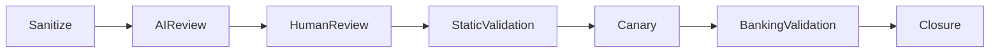

[🏠 Overview](README.md) · [🧠 Concepts](concepts.md) · [⌨️ Commands](commands.md) · [🧪 Lab](lab_guide.md) · [🚨 Troubleshooting](troubleshooting.md) · [🎯 Interview](interview_questions.md) · [📸 Evidence](screenshot_checklist.md)

---

# 🤖 AI-Assisted Ansible Review With Human Approval

```text
Role: Senior Ansible architect, SRE, security engineer, and banking operations reviewer
Context: Sanitized inventory, playbook, variables, check output, SLOs, approvals, and recovery evidence
Task: Identify risk, precedence conflicts, idempotency concerns, missing tests, and safer rollout options
Constraints: No secrets, remote execution, automatic approval, destructive changes, or invented evidence
Output: Scope risk, task risk, missing evidence, remediation options, rollback, banking validation, owner, and closure criteria
```



> [!WARNING]
> AI cannot approve fleet changes, infer employee intent, retrieve secrets, accept risk, or replace authoritative testing and business validation.

---

**🏦 FinBank AI DevSecOps · Day 022 of 120**
*Inventory · Validate · Automate · Converge · Verify · Govern*
