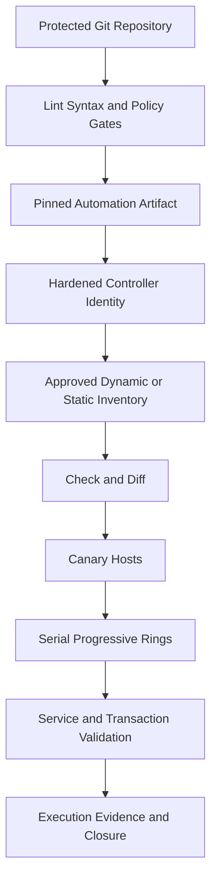
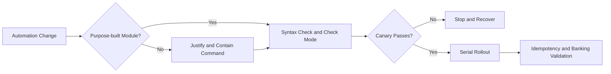

[🏠 Overview](README.md) · [🧠 Concepts](concepts.md) · [⌨️ Commands](commands.md) · [🧪 Lab](lab_guide.md) · [🚨 Troubleshooting](troubleshooting.md) · [🎯 Interview](interview_questions.md) · [📸 Evidence](screenshot_checklist.md)

---

# 🏗️ Ansible Control Plane, Rollout Rings & Decisions

> [!NOTE]
> Day022 is a safe Ansible-foundations and automation-governance lab. The package uses a localhost inventory, check mode, syntax validation, synthetic banking configuration, and repository-local evidence. It does not connect to remote hosts, retrieve secrets, restart services, or create AWS resources.

## Why This Matters

Configuration automation converts desired state into repeatable execution. Enterprise safety requires deterministic inventory, idempotent tasks, check mode, review, bounded privilege, canary rollout, recovery, business validation, and attributable evidence.

## Banking Lens

Automation must preserve payment availability, authentication, idempotency, queues, databases, ledgers, fraud controls, audit delivery, and recovery objectives.

| Decision | Required Evidence | Trade-off |
|---|---|---|
| static vs dynamic inventory | source ownership and freshness | simplicity vs scale |
| push vs pull | trust and connectivity | central control vs autonomy |
| module vs command | capability and idempotency | safety vs flexibility |
| check mode vs canary | module support and side effects | preview vs proof |
| mutable convergence vs rebuild | state and image maturity | speed vs consistency |
| centralized vs segmented controller | tenancy and blast radius | governance vs isolation |

> [!CAUTION]
> Controller credentials and inventory can provide fleet-wide reach. Protect controller identity, source, artifacts, logs, secrets, approvals, and network paths.

---

**🏦 FinBank AI DevSecOps · Day 022 of 120**
*Inventory · Validate · Automate · Converge · Verify · Govern*
