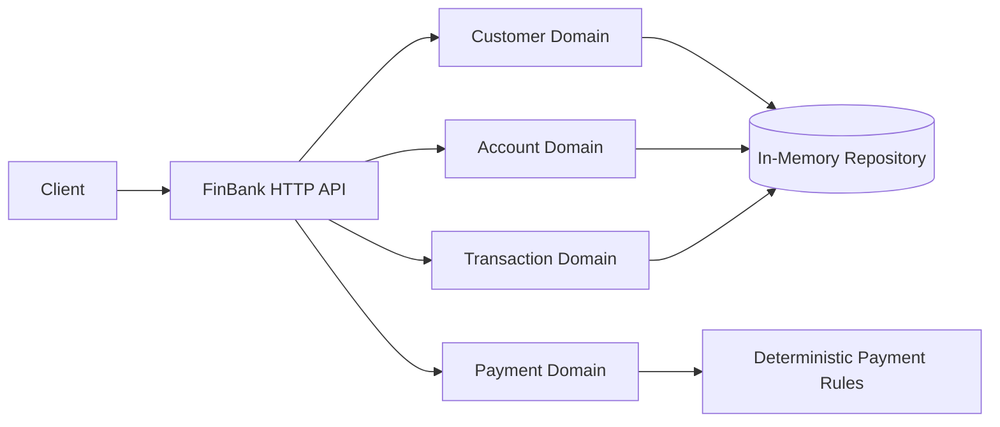

[🏠 Overview](README.md) · [🧠 Concepts](concepts.md) · [⌨️ Commands](commands.md) · [🧪 Lab](lab_guide.md) · [🚨 Troubleshooting](troubleshooting.md) · [🎯 Interview](interview_questions.md) · [📸 Evidence](screenshot_checklist.md)

---

# 🏦 Day 023: Runnable FinBank Core Architecture Foundation

> [!NOTE]
> Day023 is the first runnable FinBank application milestone. It delivers a dependency-free Java 17 HTTP application with customer, account, transaction, payment, health, and architecture endpoints. State is intentionally in-memory for this milestone and will evolve toward database-backed Spring Boot services across later days.

## Day120 Direction

Day023 establishes business boundaries and runnable behavior. Future milestones will incrementally add persistence, Spring Boot, security, events, containers, CI/CD, Kubernetes, AWS, observability, resilience, audit, fraud intelligence, and production governance until the complete platform is ready at Day120.


## Run It

```bash
./scripts/day023/build-finbank.sh
./scripts/day023/start-finbank.sh
./scripts/day023/smoke-test.sh
./scripts/day023/stop-finbank.sh
```

## Current API Surface

| Endpoint | Method | Purpose |
|---|---|---|
| `/health` | GET | liveness and service identity |
| `/architecture` | GET | current milestone architecture |
| `/customers` | GET | list synthetic customers |
| `/accounts` | GET | list synthetic accounts |
| `/transactions` | GET | list synthetic transactions |
| `/payments/quote` | GET | deterministic payment-fee quote |

## Architecture



> [!IMPORTANT]
> The application stores only synthetic data in memory. Restarting the process resets state. Day023 is an architecture foundation, not the final Day120 implementation.

---

**🏦 FinBank AI DevSecOps · Day 023 of 120**
*Model · Build · Run · Test · Secure · Evolve*
