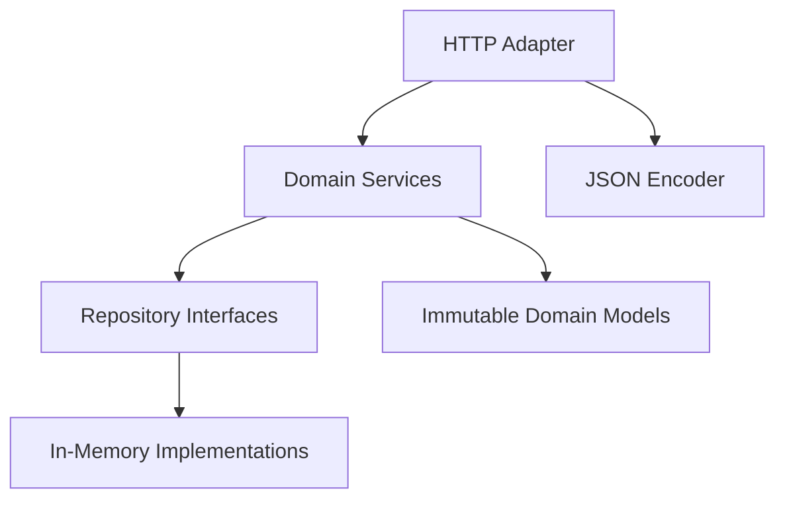

[🏠 Overview](README.md) · [🧠 Concepts](concepts.md) · [⌨️ Commands](commands.md) · [🧪 Lab](lab_guide.md) · [🚨 Troubleshooting](troubleshooting.md) · [🎯 Interview](interview_questions.md) · [📸 Evidence](screenshot_checklist.md)

---

# 🏗️ FinBank Architecture, Boundaries & Evolution Decisions

> [!NOTE]
> Day023 is the first runnable FinBank application milestone. It delivers a dependency-free Java 17 HTTP application with customer, account, transaction, payment, health, and architecture endpoints. State is intentionally in-memory for this milestone and will evolve toward database-backed Spring Boot services across later days.

## Day120 Direction

Day023 establishes business boundaries and runnable behavior. Future milestones will incrementally add persistence, Spring Boot, security, events, containers, CI/CD, Kubernetes, AWS, observability, resilience, audit, fraud intelligence, and production governance until the complete platform is ready at Day120.

## Decisions

| Decision | Day023 Choice | Rationale | Future Change |
|---|---|---|---|
| runtime | Java 17 JDK HTTP server | runnable without external dependencies | Spring Boot |
| persistence | in-memory synthetic repository | safe first milestone | PostgreSQL and Flyway |
| API | read-only JSON | avoids unsafe mutation before controls | validated command APIs |
| money | integer minor units | deterministic arithmetic | value object and database decimal |
| deployment | localhost process | bounded exposure | containers, Kubernetes and AWS |
| security | local binding only | explicit milestone boundary | OAuth2, TLS, RBAC and secrets |

## Service Extraction Rule

A boundary becomes an independent service when ownership, release cadence, scaling, data authority, failure isolation, and operational maturity justify the distributed-system cost.

---

**🏦 FinBank AI DevSecOps · Day 023 of 120**
*Model · Build · Run · Test · Secure · Evolve*
