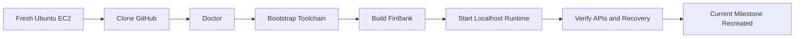

[🏠 Overview](README.md) · [🧠 Concepts](concepts.md) · [⌨️ Commands](commands.md) · [🧪 Lab](lab_guide.md) · [🚨 Troubleshooting](troubleshooting.md) · [🎯 Interview](interview_questions.md) · [📸 Evidence](screenshot_checklist.md)

---

# ♻️ Day 024: Fresh-Clone Bootstrap, Toolchain Reproducibility & Disaster Recovery

> [!IMPORTANT]
> Day024 turns the repository into the recovery source of truth. A fresh Ubuntu machine can validate or install the approved toolchain, rebuild the Day023 FinBank application, start it on localhost, verify its APIs, stop it safely, and produce recovery evidence without relying on chat history or the original EC2 disk.

## Recovery Principle

GitHub stores everything required to recreate the application and development environment, but stores no secrets, private keys, real banking data, runtime database contents, or sensitive Terraform state.

## One-Shot Recovery

```bash
git clone git@github.com:stocksdetailsteja-arch/FinBank-AI-DevSecOps.git
cd FinBank-AI-DevSecOps
./finbank bootstrap --install
./finbank build
./finbank start
./finbank verify
```

## Root Command Surface

| Command | Outcome |
|---|---|
| `./finbank doctor` | inspect operating system, tools, resources and repository |
| `./finbank bootstrap` | validate prerequisites and prepare safe local folders |
| `./finbank bootstrap --install` | install missing approved Ubuntu prerequisites |
| `./finbank build` | compile the runnable FinBank application |
| `./finbank start` | start localhost FinBank runtime |
| `./finbank status` | show branch, toolchain and process status |
| `./finbank test` | run the API smoke test |
| `./finbank verify` | execute environment, application and recovery gates |
| `./finbank stop` | stop only the tracked FinBank process |
| `./finbank reset` | remove generated local artifacts, never source |
| `./finbank backup` | capture a safe metadata snapshot |
| `./finbank restore` | display and validate the restore workflow |



> [!WARNING]
> Infrastructure creation and paid AWS actions remain explicit. Bootstrap installs local prerequisites only and never performs `terraform apply` or creates cloud resources.

---

**🏦 FinBank AI DevSecOps · Day 024 of 120**
*Clone · Bootstrap · Build · Verify · Recover · Govern*
