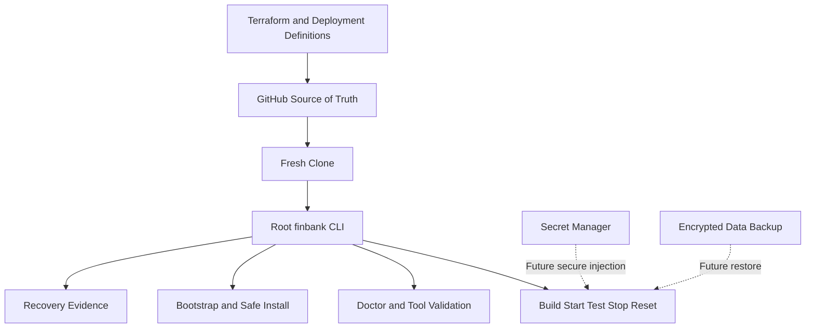

[🏠 Overview](README.md) · [🧠 Concepts](concepts.md) · [⌨️ Commands](commands.md) · [🧪 Lab](lab_guide.md) · [🚨 Troubleshooting](troubleshooting.md) · [🎯 Interview](interview_questions.md) · [📸 Evidence](screenshot_checklist.md)

---

# 🏗️ Recovery Architecture, Trust Boundaries & Decisions

> [!IMPORTANT]
> Day024 turns the repository into the recovery source of truth. A fresh Ubuntu machine can validate or install the approved toolchain, rebuild the Day023 FinBank application, start it on localhost, verify its APIs, stop it safely, and produce recovery evidence without relying on chat history or the original EC2 disk.

## Recovery Principle

GitHub stores everything required to recreate the application and development environment, but stores no secrets, private keys, real banking data, runtime database contents, or sensitive Terraform state.

## Trust Boundaries

| Boundary | Protected Material | Control |
|---|---|---|
| GitHub | source and definitions | branch protection, review, secret scanning |
| EC2 | temporary build and runtime | disposable host, least privilege, reset |
| secret manager | credentials and keys | access policy, rotation, audit |
| backup store | persistent data | encryption, retention, restore tests |
| Terraform backend | infrastructure state | encryption, locking, restricted access |

## Decisions

- One repository remains the learning and recovery source through Day120.
- Root commands provide stable user experience while internal tools evolve.
- Local bootstrap never creates paid cloud resources implicitly.
- Generated artifacts are rebuilt, not committed.
- Real data and secrets are never placed in the public portfolio repository.

---

**🏦 FinBank AI DevSecOps · Day 024 of 120**
*Clone · Bootstrap · Build · Verify · Recover · Govern*
