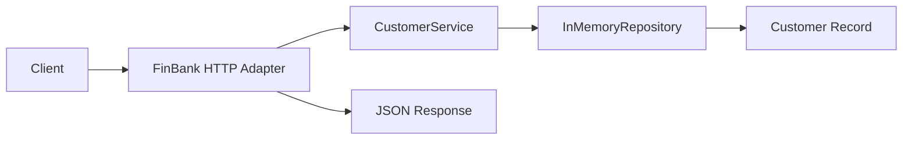

[🏠 Overview](README.md) · [🧠 Concepts](concepts.md) · [⌨️ Commands](commands.md) · [🧪 Lab](lab_guide.md) · [🚨 Troubleshooting](troubleshooting.md) · [🎯 Interview](interview_questions.md) · [📸 Evidence](screenshot_checklist.md)

---

# 👤 Day 025: Customer Service Foundation

> [!IMPORTANT]
> Day025 introduces the first explicit application service layer. `CustomerService` now owns customer retrieval and lookup behavior, while the HTTP adapter handles routing and status codes. The package preserves the Day024 recovery interface so a fresh clone can rebuild and verify the new feature.

## Day120 Direction

The customer domain will evolve from synthetic read-only data into validated Spring Boot APIs, persistent PostgreSQL storage, authorization, audit events, integration contracts, containers, observability and banking-grade operational controls.

## Feature Delivered

```text
GET /customers
GET /customers/CUS-1001
GET /customers/CUS-9999
```

Expected behavior:

| Request | Result |
|---|---|
| existing collection | HTTP 200 with all synthetic customers |
| existing customer ID | HTTP 200 with one customer |
| unknown customer ID | HTTP 404 with stable error JSON |
| malformed customer path | HTTP 404 |

## Architecture



## Recovery-Aware Lifecycle

```bash
./finbank bootstrap
./finbank build
./finbank start
./finbank test
./finbank verify
./finbank stop
```

> [!NOTE]
> Day025 still uses synthetic in-memory data and localhost-only HTTP. Mutation, persistence, authentication and audit are intentionally deferred to later controlled milestones.

---

**🏦 FinBank AI DevSecOps · Day 025 of 120**
*Route · Validate · Serve · Test · Recover · Evolve*
