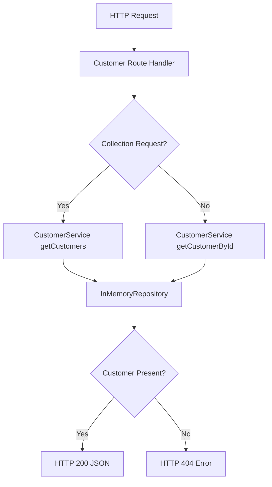

[🏠 Overview](README.md) · [🧠 Concepts](concepts.md) · [⌨️ Commands](commands.md) · [🧪 Lab](lab_guide.md) · [🚨 Troubleshooting](troubleshooting.md) · [🎯 Interview](interview_questions.md) · [📸 Evidence](screenshot_checklist.md)

---

# 🏗️ Customer Domain Architecture & Evolution Decisions

> [!IMPORTANT]
> Day025 introduces the first explicit application service layer. `CustomerService` now owns customer retrieval and lookup behavior, while the HTTP adapter handles routing and status codes. The package preserves the Day024 recovery interface so a fresh clone can rebuild and verify the new feature.

## Day120 Direction

The customer domain will evolve from synthetic read-only data into validated Spring Boot APIs, persistent PostgreSQL storage, authorization, audit events, integration contracts, containers, observability and banking-grade operational controls.

## Decisions

| Decision | Day025 Choice | Future Evolution |
|---|---|---|
| application form | modular Java core | Spring Boot module or service |
| repository | in-memory | PostgreSQL JPA repository |
| result absence | `Optional<Customer>` | domain-aware result and error contract |
| API style | read-only GET | validated create and update commands |
| security | localhost boundary | OAuth2, RBAC and field policy |
| audit | Git and test evidence | immutable customer access events |

## Extraction Criteria

Customer becomes a separate deployable service only when data ownership, independent release, scale, failure isolation and operational maturity justify network and distributed-system complexity.

---

**🏦 FinBank AI DevSecOps · Day 025 of 120**
*Route · Validate · Serve · Test · Recover · Evolve*
