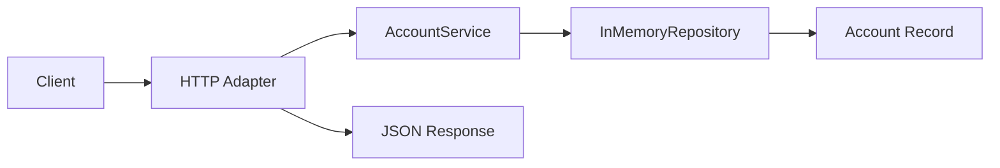

[🏠 Overview](README.md) · [🧠 Concepts](concepts.md) · [⌨️ Commands](commands.md) · [🧪 Lab](lab_guide.md) · [🚨 Troubleshooting](troubleshooting.md) · [🎯 Interview](interview_questions.md) · [📸 Evidence](screenshot_checklist.md)

---

# 🏦 Day 026: Account Service Foundation

> [!IMPORTANT]
> Day026 introduces `AccountService` as the account-domain service boundary. Collection and identifier lookup now flow through a dedicated service, while the HTTP adapter maps domain results to HTTP 200 and HTTP 404. Day024 recovery and Day025 customer behavior remain mandatory regression gates.

## Day120 Direction

The account domain will evolve toward validated Spring Boot APIs, PostgreSQL persistence, ledger-safe balance handling, authorization, audit events, concurrency controls, containers, observability and disaster recovery.

## Feature Delivered

```text
GET /accounts
GET /accounts/ACC-2001
GET /accounts/ACC-2002
GET /accounts/ACC-9999
```

| Request | Expected Result |
|---|---|
| account collection | HTTP 200 with synthetic accounts |
| known account ID | HTTP 200 with account JSON |
| unknown account ID | HTTP 404 with `Account Not Found` |
| malformed account path | HTTP 404 |



```bash
./finbank bootstrap
./finbank build
./finbank start
./finbank test
./finbank verify
./finbank stop
```

---

**🏦 FinBank AI DevSecOps · Day 026 of 120**
*Own · Validate · Serve · Test · Recover · Evolve*
