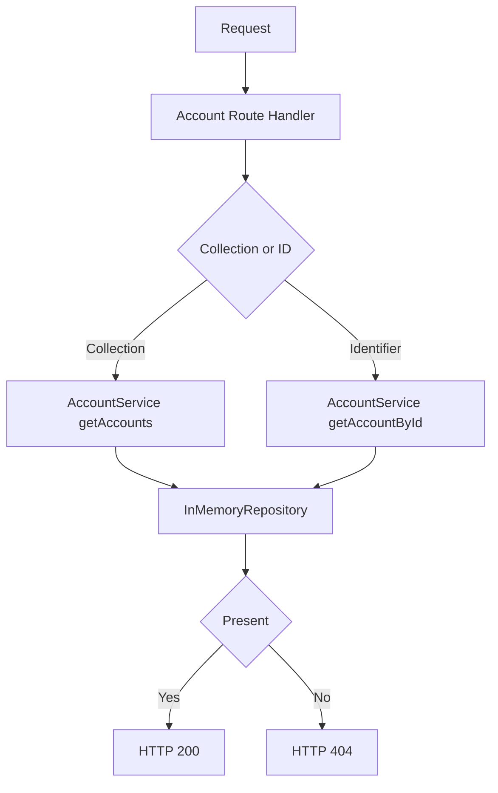

[🏠 Overview](README.md) · [🧠 Concepts](concepts.md) · [⌨️ Commands](commands.md) · [🧪 Lab](lab_guide.md) · [🚨 Troubleshooting](troubleshooting.md) · [🎯 Interview](interview_questions.md) · [📸 Evidence](screenshot_checklist.md)

---

# 🏗️ Account Architecture, Balance Boundaries & Evolution

> [!IMPORTANT]
> Day026 introduces `AccountService` as the account-domain service boundary. Collection and identifier lookup now flow through a dedicated service, while the HTTP adapter maps domain results to HTTP 200 and HTTP 404. Day024 recovery and Day025 customer behavior remain mandatory regression gates.

## Day120 Direction

The account domain will evolve toward validated Spring Boot APIs, PostgreSQL persistence, ledger-safe balance handling, authorization, audit events, concurrency controls, containers, observability and disaster recovery.

## Architecture Decisions

| Decision | Day026 | Future |
|---|---|---|
| service | modular Java class | Spring Boot service component |
| persistence | in-memory | PostgreSQL and JPA |
| balance | immutable minor units | ledger-derived available and booked balances |
| endpoint | read-only GET | validated account lifecycle commands |
| security | localhost-only | OAuth2, authorization and ownership rules |
| audit | Git and evidence | immutable access and lifecycle events |

> [!WARNING]
> An account balance should eventually be derived from controlled ledger entries, not updated as an unconstrained mutable field.

---

**🏦 FinBank AI DevSecOps · Day 026 of 120**
*Own · Validate · Serve · Test · Recover · Evolve*
