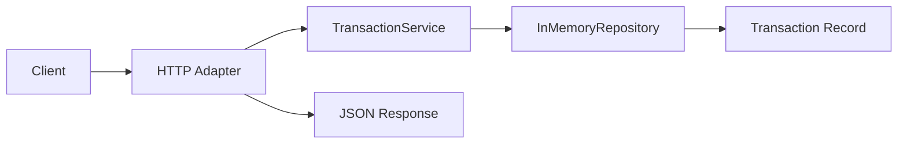

[🏠 Overview](README.md) · [🧠 Concepts](concepts.md) · [⌨️ Commands](commands.md) · [🧪 Lab](lab_guide.md) · [🚨 Troubleshooting](troubleshooting.md) · [🎯 Interview](interview_questions.md) · [📸 Evidence](screenshot_checklist.md)

---

# 💳 Day 027: Transaction Service Foundation

> [!IMPORTANT]
> Day027 introduces `TransactionService` as the transaction-domain service boundary. Transaction collection and identifier lookup now flow through a dedicated service, while the HTTP adapter maps results to HTTP 200 and HTTP 404. Customer, account and recovery behavior remain mandatory regression gates.

## Day120 Direction

The transaction domain will evolve toward immutable ledger postings, validated commands, PostgreSQL persistence, idempotency, event publication, fraud controls, reconciliation, authorization, observability and disaster recovery.

## Feature Delivered

```text
GET /transactions
GET /transactions/TXN-3001
GET /transactions/TXN-3002
GET /transactions/TXN-9999
```

| Request | Outcome |
|---|---|
| transaction collection | HTTP 200 with synthetic transactions |
| known transaction | HTTP 200 with transaction JSON |
| unknown transaction | HTTP 404 with `Transaction Not Found` |
| malformed path | HTTP 404 |



## Recovery-Aware Lifecycle

```bash
./finbank bootstrap
./finbank build
./finbank start
./finbank test
./finbank verify
./finbank stop
```

---

**🏦 FinBank AI DevSecOps · Day 027 of 120**
*Trace · Validate · Serve · Test · Recover · Evolve*
