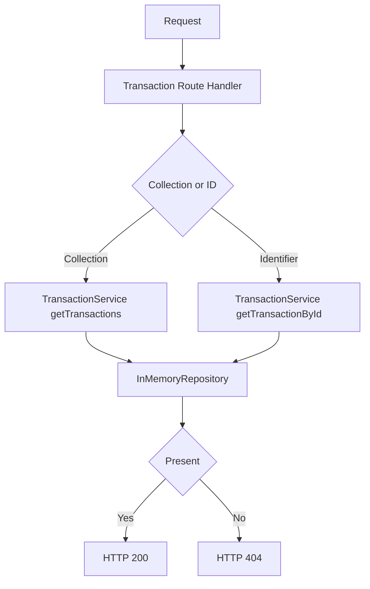

[🏠 Overview](README.md) · [🧠 Concepts](concepts.md) · [⌨️ Commands](commands.md) · [🧪 Lab](lab_guide.md) · [🚨 Troubleshooting](troubleshooting.md) · [🎯 Interview](interview_questions.md) · [📸 Evidence](screenshot_checklist.md)

---

# 🏗️ Transaction Architecture, State & Ledger Evolution

> [!IMPORTANT]
> Day027 introduces `TransactionService` as the transaction-domain service boundary. Transaction collection and identifier lookup now flow through a dedicated service, while the HTTP adapter maps results to HTTP 200 and HTTP 404. Customer, account and recovery behavior remain mandatory regression gates.

## Day120 Direction

The transaction domain will evolve toward immutable ledger postings, validated commands, PostgreSQL persistence, idempotency, event publication, fraud controls, reconciliation, authorization, observability and disaster recovery.

## Decisions

| Decision | Day027 | Future |
|---|---|---|
| service | modular Java class | Spring Boot service |
| data | in-memory synthetic | PostgreSQL and migrations |
| state | POSTED only | controlled lifecycle state machine |
| money | integer minor units | ledger and currency rules |
| API | read-only GET | idempotent command endpoints |
| audit | Git and evidence | immutable financial audit events |

> [!WARNING]
> A transaction record is not a complete accounting ledger. Financial correctness requires balanced postings, immutable history and reconciliation.

---

**🏦 FinBank AI DevSecOps · Day 027 of 120**
*Trace · Validate · Serve · Test · Recover · Evolve*
