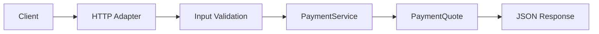

[🏠 Overview](README.md) · [🧠 Concepts](concepts.md) · [⌨️ Commands](commands.md) · [🧪 Lab](lab_guide.md) · [🚨 Troubleshooting](troubleshooting.md) · [🎯 Interview](interview_questions.md) · [📸 Evidence](screenshot_checklist.md)

---

# 💸 Day 028: Payment Service Foundation

> [!IMPORTANT]
> Day028 introduces `PaymentService` as the payment-domain service boundary for deterministic quote calculation. The HTTP adapter validates transport inputs and maps service results, while fee policy and money calculations live in a dedicated service. Customer, account, transaction and recovery behavior remain mandatory regression gates.

## Day120 Direction

The payment domain will evolve from read-only quotes into validated payment intents, authorization, idempotency, ledger posting, settlement, fraud screening, event publication, reconciliation, observability and disaster recovery.

## Feature Delivered

```text
GET /payments/quote?amountMinor=10000
GET /payments/quote?amountMinor=1
GET /payments/quote?amountMinor=0
GET /payments/quote?amountMinor=invalid
```

| Request | Outcome |
|---|---|
| positive amount | HTTP 200 with deterministic quote |
| minimum positive amount | minimum fee policy applied |
| zero or negative amount | HTTP 400 |
| non-numeric amount | HTTP 400 |



## Recovery-Aware Lifecycle

```bash
./finbank bootstrap
./finbank build
./finbank start
./finbank test
./finbank verify
./finbank stop
```

---

**🏦 FinBank AI DevSecOps · Day 028 of 120**
*Quote · Validate · Calculate · Test · Recover · Evolve*
