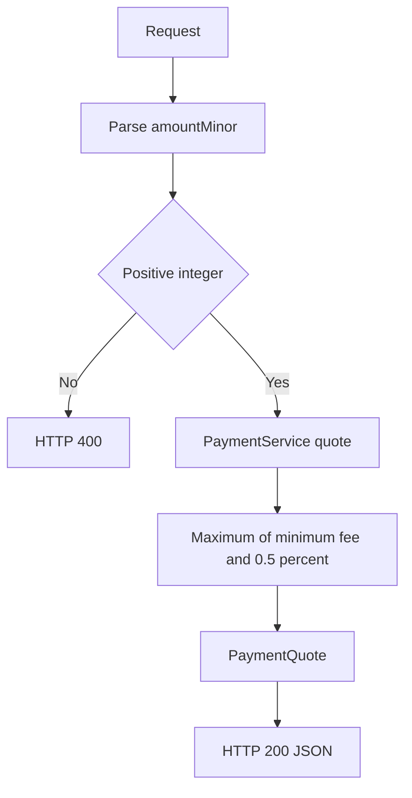

[🏠 Overview](README.md) · [🧠 Concepts](concepts.md) · [⌨️ Commands](commands.md) · [🧪 Lab](lab_guide.md) · [🚨 Troubleshooting](troubleshooting.md) · [🎯 Interview](interview_questions.md) · [📸 Evidence](screenshot_checklist.md)

---

# 🏗️ Payment Quote Architecture & Future Processing Stages

> [!IMPORTANT]
> Day028 introduces `PaymentService` as the payment-domain service boundary for deterministic quote calculation. The HTTP adapter validates transport inputs and maps service results, while fee policy and money calculations live in a dedicated service. Customer, account, transaction and recovery behavior remain mandatory regression gates.

## Day120 Direction

The payment domain will evolve from read-only quotes into validated payment intents, authorization, idempotency, ledger posting, settlement, fraud screening, event publication, reconciliation, observability and disaster recovery.

## Decisions

| Decision | Day028 | Future |
|---|---|---|
| capability | quote only | intent, authorization, posting, settlement |
| service | modular Java class | Spring Boot service |
| money | integer minor units | currency-aware domain library |
| fee | deterministic local policy | versioned product and channel pricing |
| persistence | none | PostgreSQL payment and ledger records |
| security | localhost-only | OAuth2, limits, fraud and approvals |

> [!WARNING]
> A payment quote must never be treated as proof of authorization, account debit, posting or settlement.

---

**🏦 FinBank AI DevSecOps · Day 028 of 120**
*Quote · Validate · Calculate · Test · Recover · Evolve*
