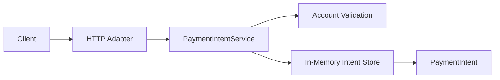

[🏠 Overview](README.md) · [🧠 Concepts](concepts.md) · [⌨️ Commands](commands.md) · [🧪 Lab](lab_guide.md) · [🚨 Troubleshooting](troubleshooting.md) · [🎯 Interview](interview_questions.md) · [📸 Evidence](screenshot_checklist.md)

---

# 🧾 Day 029: Payment Intent Foundation

> [!IMPORTANT]
> Day029 introduces an in-memory `PaymentIntentService` and immutable `PaymentIntent` model. The milestone creates deterministic synthetic payment intents, lists intents, retrieves an intent by identifier, validates account and amount inputs, and preserves all Day023-Day028 regression and recovery gates.

## Day120 Direction

Payment intents will later gain persistent identifiers, idempotency keys, authorization, state transitions, ledger posting, fraud decisions, event publication, expiry, settlement and reconciliation.

## API Target

```text
GET  /payment-intents
GET  /payment-intents/PAY-4001
POST /payment-intents?sourceAccountId=ACC-2001&destinationAccountId=ACC-2002&amountMinor=10000
GET  /payment-intents/PAY-9999
```

| Request | Outcome |
|---|---|
| list intents | HTTP 200 |
| known intent | HTTP 200 |
| valid create request | HTTP 201 with CREATED intent |
| unknown intent | HTTP 404 |
| invalid account or amount | HTTP 400 |



> [!WARNING]
> CREATED is not AUTHORIZED, POSTED or SETTLED. Day029 never moves funds.

---

**🏦 FinBank AI DevSecOps · Day 029 of 120**
*Create · Identify · Validate · Test · Recover · Govern*
