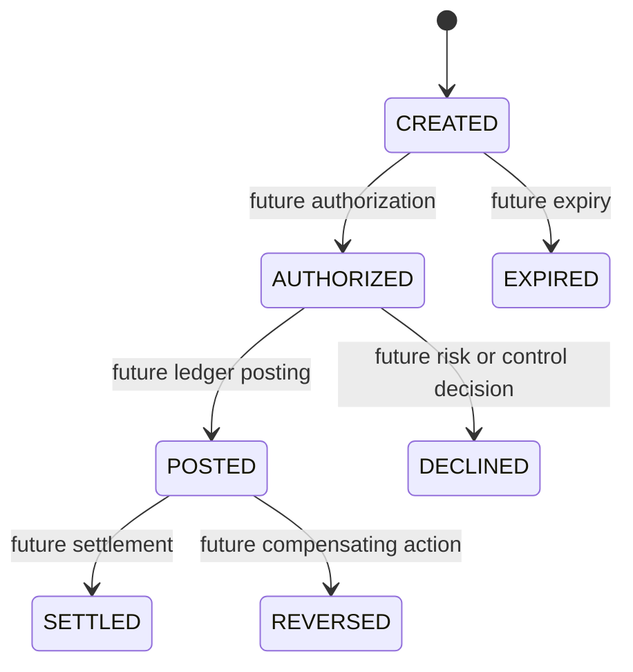

[🏠 Overview](README.md) · [🧠 Concepts](concepts.md) · [⌨️ Commands](commands.md) · [🧪 Lab](lab_guide.md) · [🚨 Troubleshooting](troubleshooting.md) · [🎯 Interview](interview_questions.md) · [📸 Evidence](screenshot_checklist.md)

---

# 🏗️ Payment Intent Architecture & State Evolution

> [!IMPORTANT]
> Day029 introduces an in-memory `PaymentIntentService` and immutable `PaymentIntent` model. The milestone creates deterministic synthetic payment intents, lists intents, retrieves an intent by identifier, validates account and amount inputs, and preserves all Day023-Day028 regression and recovery gates.

## Day120 Direction

Payment intents will later gain persistent identifiers, idempotency keys, authorization, state transitions, ledger posting, fraud decisions, event publication, expiry, settlement and reconciliation.

## Day029 Decisions

| Area | Current Choice | Future Control |
|---|---|---|
| storage | in-memory list | PostgreSQL |
| identifier | process sequence | durable unique ID |
| state | CREATED | controlled state machine |
| validation | accounts and positive amount | limits, ownership and sanctions |
| currency | INR | currency and FX policy |
| idempotency | documented gap | required key and uniqueness |
| audit | evidence files | immutable business events |

---

**🏦 FinBank AI DevSecOps · Day 029 of 120**
*Create · Identify · Validate · Test · Recover · Govern*
