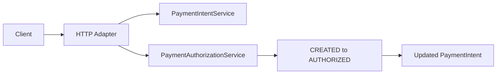

[🏠 Overview](README.md) · [🧠 Concepts](concepts.md) · [⌨️ Commands](commands.md) · [🧪 Lab](lab_guide.md) · [🚨 Troubleshooting](troubleshooting.md) · [🎯 Interview](interview_questions.md) · [📸 Evidence](screenshot_checklist.md)

---

# ✅ Day 030: Payment Authorization Foundation

> [!IMPORTANT]
> Day030 introduces an explicit payment authorization boundary. A CREATED payment intent can transition to AUTHORIZED through `PaymentAuthorizationService`; repeated or invalid transitions fail safely. Authorization does not post a ledger entry, debit an account, execute a payment or prove settlement.

## Day120 Direction

Authorization will later incorporate authenticated actors, ownership, limits, fraud and sanctions decisions, durable state, optimistic locking, idempotency, audit events, ledger commands and reconciliation.

## API Target

```text
POST /payment-intents
POST /payment-intents/PAY-4001/authorize
GET  /payment-intents/PAY-4001
POST /payment-intents/PAY-9999/authorize
```

| Request | Outcome |
|---|---|
| create valid intent | HTTP 201, CREATED |
| authorize CREATED intent | HTTP 200, AUTHORIZED |
| authorize missing intent | HTTP 404 |
| authorize again | HTTP 409 |
| malformed authorization path | HTTP 404 |



---

**🏦 FinBank AI DevSecOps · Day 030 of 120**
*Authorize · Transition · Audit · Test · Recover · Govern*
