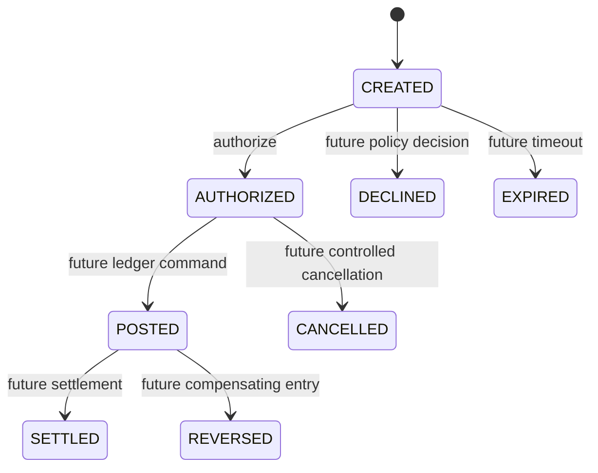

[🏠 Overview](README.md) · [🧠 Concepts](concepts.md) · [⌨️ Commands](commands.md) · [🧪 Lab](lab_guide.md) · [🚨 Troubleshooting](troubleshooting.md) · [🎯 Interview](interview_questions.md) · [📸 Evidence](screenshot_checklist.md)

---

# 🏗️ Payment Authorization Architecture & Control Flow

> [!IMPORTANT]
> Day030 introduces an explicit payment authorization boundary. A CREATED payment intent can transition to AUTHORIZED through `PaymentAuthorizationService`; repeated or invalid transitions fail safely. Authorization does not post a ledger entry, debit an account, execute a payment or prove settlement.

## Day120 Direction

Authorization will later incorporate authenticated actors, ownership, limits, fraud and sanctions decisions, durable state, optimistic locking, idempotency, audit events, ledger commands and reconciliation.

## Decision Matrix

| Area | Day030 | Production Target |
|---|---|---|
| state | in-memory immutable replacement | persistent versioned state |
| concurrency | synchronized service | database optimistic locking |
| actor | not modeled | authenticated principal |
| controls | current-state check | limits, funds, fraud, sanctions |
| audit | evidence | immutable authorization event |
| ledger | not invoked | idempotent posting command |

---

**🏦 FinBank AI DevSecOps · Day 030 of 120**
*Authorize · Transition · Audit · Test · Recover · Govern*
