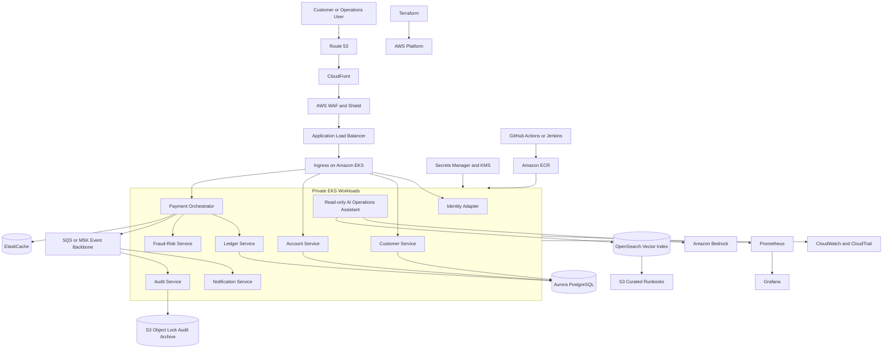
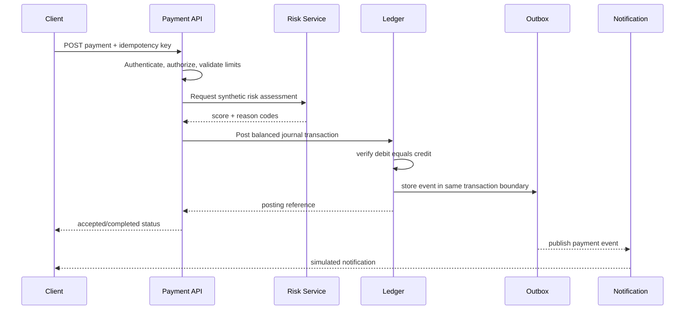

# FinBank AI Flagship Architecture

## Scope
FinBank AI is a learning platform for simulated retail-banking workflows. It supports identity, customer profile, account view, beneficiary management, payment initiation, ledger posting, notification, risk signals, audit evidence, and a read-only AI operations assistant. It does not connect to a real payment network and does not provide financial advice.

## Architecture principles
- Zero trust, least privilege and short-lived credentials.
- API-led bounded services with explicit ownership.
- Double-entry ledger invariants and immutable audit events.
- Idempotent payment APIs and duplicate protection.
- Event-driven integration with outbox and replay controls.
- Multi-AZ service design and tested recovery.
- Encryption in transit and at rest.
- Synthetic data only.
- Human approval for privileged, high-risk, production, money-movement, or AI-agent actions.

## Logical architecture

## Recommended business boundaries
| Service | Owns | Does not own |
|---|---|---|
| Customer | profile, contact preferences, KYC simulation state | balances or postings |
| Account | account metadata and read models | authoritative journal entries |
| Payment | validation, idempotency, orchestration and status | ledger integrity logic |
| Ledger | debit/credit journal, invariant checks and posting | notifications |
| Fraud-Risk | synthetic rules or model score, reason codes | final autonomous blocking policy |
| Notification | email/SMS simulation and retry | payment truth |
| Audit | append-only business and control events | mutable business records |
| AI Operations | retrieve approved runbooks and summarize evidence | execute privileged actions in v1 |

## Payment sequence

## AWS network design
- One VPC across at least two Availability Zones.
- Public subnets contain only internet-facing load balancers and NAT gateways where required.
- Private application subnets contain EKS nodes or compute.
- Isolated data subnets contain Aurora and ElastiCache.
- VPC endpoints reduce public-path dependency for AWS APIs such as S3 and ECR where appropriate.
- Flow logs, CloudTrail and application audit events provide separate evidence layers.

## AI operations assistant
The initial release is read-only. It retrieves curated runbooks, architecture decisions and sanitized incident examples, then produces an answer with evidence references. It must reject requests for secrets, customer records, unrestricted shell commands or direct production changes.

### AI trust controls
1. Curate and version the knowledge base.
2. Apply document-level access controls.
3. Separate user input from system instructions.
4. Detect prompt-injection patterns and unsupported requests.
5. Require citations to retrieved evidence.
6. Evaluate groundedness, correctness, harmful output and refusal behavior.
7. Log model, prompt version, retrieval IDs, latency, token usage and user feedback without storing secrets.
8. Keep a kill switch and explicit human approval boundary.

## Availability and recovery
- Use multiple Availability Zones for the ingress, compute and database tiers.
- Define service-specific RTO and RPO as project requirements, then prove them with restore tests.
- Use retries only for transient errors, with exponential backoff, jitter and bounded attempt counts.
- Use queues and dead-letter queues for asynchronous failures.
- Prefer graceful degradation: account history may remain available while notifications are delayed.

## Security verification
- Threat model each trust boundary.
- Enforce authentication, authorization, rate limits, schema validation and idempotency.
- Scan source, dependencies, images, IaC and secrets in CI.
- Generate an SBOM and preserve build provenance.
- Restrict egress and east-west traffic.
- Rotate secrets and test access revocation.
- Keep AI permissions read-only until controls and evaluations prove a narrower action safe.

## Cost-conscious learning profile
Run local containers and kind/minikube for most practice. Provision EKS, NAT gateways, load balancers, Aurora and managed search only for defined milestones. Tag every resource, apply budgets, and destroy temporary environments immediately after evidence capture.
